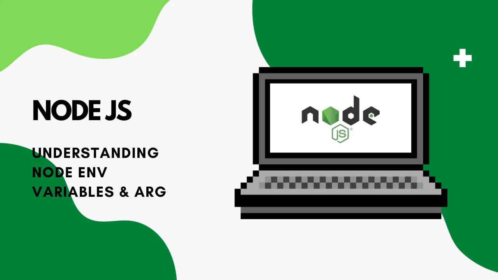
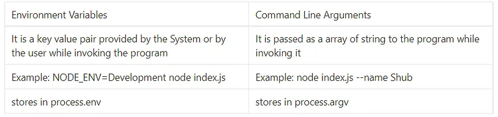
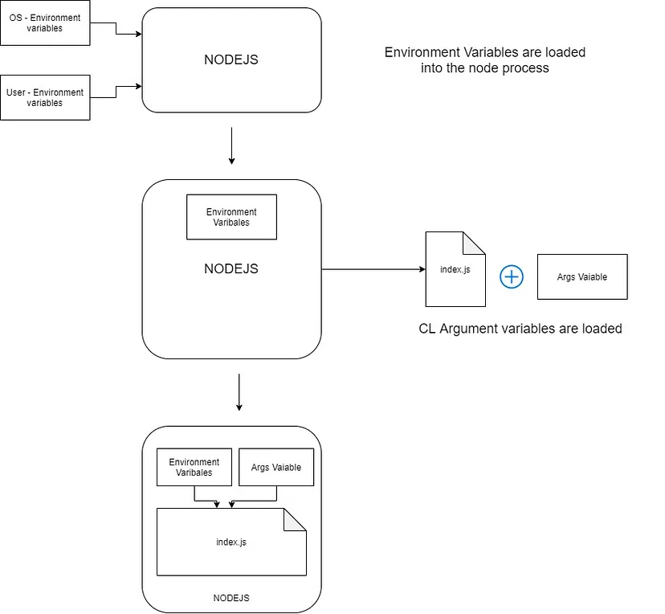

In one way or another your NodeJS process need some prior information before firing up the actual program. Most of these information are stored in some sort of constants, These constants are Environment variables and Command Line Arguments.

There is a slight difference between these two constants:



Difference between Env variable & CL Arguments
In Environment variable the constant key value pair is provided by the system itself or by the user while invoking the program Example:
```shell
NODE_ENV=Development node index.js
```

while in Command Line Arguments these constants are passed as an array of string to the program while invoking it.

Example: node index.js — name Shubh

Also, Environment variables should be defined before the “node” command and CL Argument after the command like
```shell
NODE_ENV=Development node index.js — — name Shubh
```
Accessing these variable in your node program can be done by using the process global object (Global Objects are built-in objects that are part of the JavaScript and can be used directly in the application without importing any particular module)

Node.js provides the facility to get process information such as process id, architecture, platform, version, release, uptime, CPU usage etc.



index.js file to show variables:
```javascript
console.log("=======CL Args=====")
console.log(process.argv)
console.log("=======Environemt Var======");
console.log(process.env)
```

Output:

```shell
$ NODE_ENV=Development node index.js --name Shubham
=======CL Args=====
[
  'C:\\Program Files\\nodejs\\node.exe',
  'C:\\Users\\SHUBHAM\\Documents\\jwt-demo\\index.js',
  '--name',
  'Shubham'
]
=======Environemt Var======
{
  ACLOCAL_PATH: '/mingw64/share/aclocal:/usr/share/aclocal',
  ALLUSERSPROFILE: 'C:\\ProgramData',
  MINGW_PACKAGE_PREFIX: 'mingw-w64-x86_64',
  MINGW_PREFIX: '/mingw64',
  MSYSTEM: 'MINGW64',
  MSYSTEM_CARCH: 'x86_64',
  MSYSTEM_CHOST: 'x86_64-w64-mingw32',
  ORIGINAL_XDG_CURRENT_DESKTOP: 'undefined',
  OS: 'Windows_NT',
  PLINK_PROTOCOL: 'ssh',
  POSH_THEMES_PATH: 'C:\\Users\\SHUBHAM\\AppData\\Local\\Programs\\oh-my-posh\\themes',
  POWERSHELL_DISTRIBUTION_CHANNEL: 'MSI:Windows 10 Home Single Language',
  PROCESSOR_ARCHITECTURE: 'AMD64',
  PROCESSOR_IDENTIFIER: 'Intel64 Family 6 Model 142 Stepping 12, GenuineIntel',
  PROCESSOR_LEVEL: '6',
  PROCESSOR_REVISION: '8e0c',
  ProgramData: 'C:\\ProgramData',
  PROGRAMFILES: 'C:\\Program Files',
  SESSIONNAME: 'Console',
  SHELL: 'C:\\Program Files\\Git\\usr\\bin\\bash.exe',
  SHLVL: '1',
  SSH_ASKPASS: '/mingw64/bin/git-askpass.exe',
  SYSTEMDRIVE: 'C:',
  SYSTEMROOT: 'C:\\WINDOWS',
  TEMP: 'C:\\Users\\SHUBHAM\\AppData\\Local\\Temp',
  TERM_PROGRAM: 'vscode',
  WINDIR: 'C:\\WINDOWS',
  _: '/usr/bin/winpty'
}
```