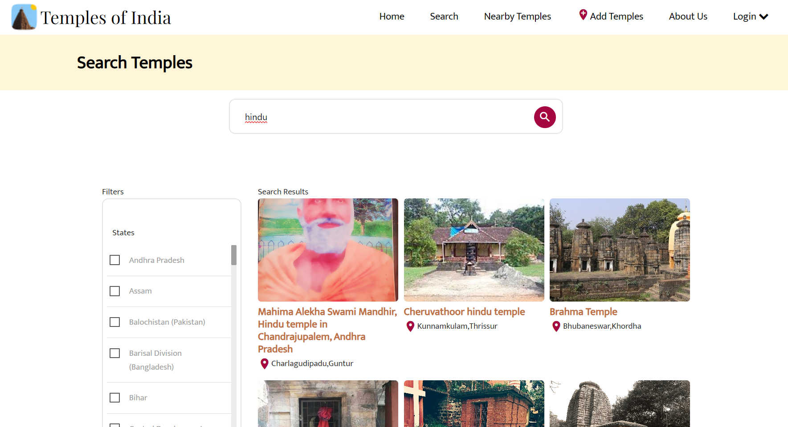

During my academic year (2020-2024) I have completed 4 internships in multiple firms including Adobe, IIT Bombay etc, where I worked on various technologies like NodeJS, Flask, Machine Learning, ELK Stack just to name a few. During this period I also improved my soft skills and leadership qualities.
 
 

## Adobe
[adobe.com](https://www.adobe.com)

### Overview

<!--  -->

I summer interned at Adobe as a CXM Intern which comes under the umberella of Adobe Digital Experience cloud, whose main aim is to provide development and maintenance to enterprise softwares for customers.

During my internship period of 2.5 months [apr 2023 - jul 2023] I worked on a varity of tech stack and tools including MS Power suit, Machine Learning, Web application. I primaraly worked on 2 projects, one of which is a ML Model to predict relevant engineer for tickets comming on zendesk. The response of this project was great and the company want us to expand this solution to other CRMs,
this result in extending our internship duration to 2 months [aug 2023 - nov 2023] more.

Further details about the projects is present in the presentation.

{}

Presentation

  <iframe allow="accelerometer; autoplay; clipboard-write; encrypted-media; gyroscope; picture-in-picture; web-share" allowfullscreen="allowfullscreen" loading="eager" referrerpolicy="strict-origin-when-cross-origin" src="https://docs.google.com/presentation/d/1g8yMCCUDRyPpKHjYbvuxfwGqBfgEKQr3/preview" style="position: absolute; top: 0; left: 0; width: 100%; height: 100%; border:0;" title="YouTube video"
  ></iframe>

Video Demo of Prognova

  <iframe allow="accelerometer; autoplay; clipboard-write; encrypted-media; gyroscope; picture-in-picture; web-share" allowfullscreen="allowfullscreen" loading="eager" referrerpolicy="strict-origin-when-cross-origin" src="https://drive.google.com/file/d/1DyyGj3SIdE34sTJn8rItpoTm4Uu9r8T-/preview" style="position: absolute; top: 0; left: 0; width: 100%; height: 100%; border:0;" title="YouTube video"
  ></iframe>

Extention of Prognova to other CRMs

  <iframe allow="accelerometer; autoplay; clipboard-write; encrypted-media; gyroscope; picture-in-picture; web-share" allowfullscreen="allowfullscreen" loading="eager" referrerpolicy="strict-origin-when-cross-origin" src="https://docs.google.com/presentation/d/1FIvGTlo-hGi3lLU4-M1zb-jx6OdIlky-2MqBr22suHc/preview" style="position: absolute; top: 0; left: 0; width: 100%; height: 100%; border:0;" title="YouTube video"
  ></iframe>


  You might not able to open the Power Point presentation because opening access is restricted to Shubham Gautam, if you want to have access to this resource please contact the owner <a href="/about-me">here</a>, or book a virtual meeting <a href="https://calendly.com/skgautam393/30min">here</a>.


{}

{}

Presentation

  <iframe allow="accelerometer; autoplay; clipboard-write; encrypted-media; gyroscope; picture-in-picture; web-share" allowfullscreen="allowfullscreen" loading="eager" referrerpolicy="strict-origin-when-cross-origin" src="https://docs.google.com/presentation/d/1AoirLX7goXC8CTDOlCGmHJHqMMf15yQ7/preview" style="position: absolute; top: 0; left: 0; width: 100%; height: 100%; border:0;" title="YouTube video"
  ></iframe>

Video Demo

  <iframe allow="accelerometer; autoplay; clipboard-write; encrypted-media; gyroscope; picture-in-picture; web-share" allowfullscreen="allowfullscreen" loading="eager" referrerpolicy="strict-origin-when-cross-origin" src="https://drive.google.com/file/d/1eyoM6b65mhhHcZsQn6iUpIHRxn5LoW85/preview" style="position: absolute; top: 0; left: 0; width: 100%; height: 100%; border:0;" title="YouTube video"
  ></iframe>


  You might not able to open the Power Point presentation because opening access is restricted to Shubham Gautam, if you want to have access to this resource please contact the owner <a href="/about-me">here</a>, or book a virtual meeting <a href="https://calendly.com/skgautam393/30min">here</a>.


{}
 

  


## IIT BOMBAY
[iitb.ac.in](https://www.iitb.ac.in/)

I worked as a Web Developer during my internship period at IIT Bombay, during this time I get my hands on both internal and public projects one of them is [Templesofindia.org](https://www.templesofindia.org), here I worked on Elastic Search and implement facted search functionality for their website and backend service in NodeJS, rebuild their home page in JSX, implementing commenting functionality on their website posts, solving bugs on their website. 

{}

Video Demo of UI redesign

  <iframe allow="accelerometer; autoplay; clipboard-write; encrypted-media; gyroscope; picture-in-picture; web-share" allowfullscreen="allowfullscreen" loading="eager" referrerpolicy="strict-origin-when-cross-origin" src="https://drive.google.com/file/d/1Q670Fr1jtuZCU4WqM1QKXSBOo_zPECnP/preview" style="position: absolute; top: 0; left: 0; width: 100%; height: 100%; border:0;" title="YouTube video"
  ></iframe>

Faceted Search Functionality


  You might not able to open the Power Point presentation because opening access is restricted to Shubham Gautam, if you want to have access to this resource please contact the owner <a href="/about-me">here</a>, or book a virtual meeting <a href="https://calendly.com/skgautam393/30min">here</a>.


{}

<!--  -->
 

  


## Eatoes
[eatoes.com](https://www.eatoes.com/)

This is my first internship, I primarily worked on Backend in NodeJS, creating APIs for user onboarding and dashboards

 

<!--  -->


  
